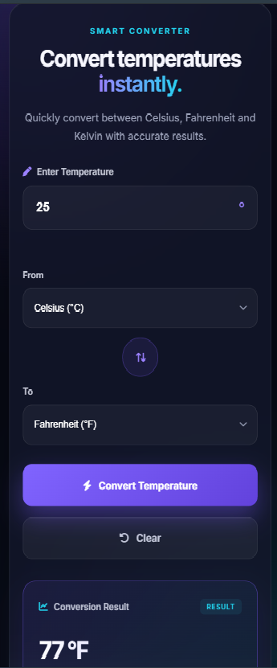
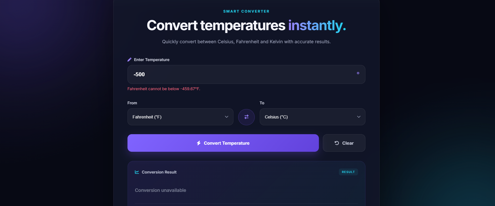

# 🌡️ Temperature Converter

A modern, responsive, and interactive **Temperature Converter Website** developed as part of the **OASIS INFOBYTE Web Development & Designing Internship – Level 1, Task 3**.

The website allows users to convert temperatures between **Celsius, Fahrenheit, and Kelvin** with proper input validation and absolute-zero error handling.
## 🌐 Live Demo

https://shiva-prajapati-777.github.io/OIBSIP/TemperatureConverter/
---

## 📌 Task Information

- **Internship:** OASIS INFOBYTE Web Development & Designing Internship
- **Track:** Web Development
- **Level:** Level 1
- **Task:** Task 3 – Temperature Converter
- **Developer:** Shiva Prajapati

---

## 🎯 Objective

Build an interactive web tool that converts temperature values between Celsius, Fahrenheit, and Kelvin with real-time input validation and user-friendly error handling.

---

## ✨ Features

- 🌡️ Convert between Celsius, Fahrenheit, and Kelvin
- 🔢 Numeric temperature input
- ✅ Input validation
- ❌ User-friendly error messages
- 🧊 Absolute-zero validation
- 🔄 Swap input and output units
- ⚡ Quick conversion buttons
- 🧹 Clear/reset button
- 📊 Dedicated result display area
- ⌨️ Press **Enter** to convert
- 📱 Responsive design for desktop, tablet, and mobile
- ✨ Modern glassmorphism-inspired UI
- 🎨 Interactive buttons and hover effects
- 💻 Built using Vanilla JavaScript

---

## 🧮 Conversion Formulas

### Celsius to Fahrenheit

°F = (°C × 9/5) + 32

### Fahrenheit to Celsius

°C = (°F − 32) × 5/9

### Celsius to Kelvin

K = °C + 273.15

### Kelvin to Celsius

°C = K − 273.15

The application converts the input temperature to Celsius internally and then converts it to the selected output unit.

---

## 🛡️ Input Validation

The application validates the entered temperature before performing the conversion.

It handles:

- Empty input
- Invalid or non-numeric input
- Temperatures below absolute zero

### Absolute Zero Limits

| Unit       | Minimum Valid Temperature |
| ---------- | ------------------------: |
| Celsius    |                 -273.15°C |
| Fahrenheit |                 -459.67°F |
| Kelvin     |                       0 K |

If the entered value is below absolute zero, the application displays a user-friendly error message.

---

## 🛠️ Technologies Used

- **HTML5** – Page structure
- **CSS3** – Styling, responsive layout, animations, and visual design
- **JavaScript (Vanilla JS)** – Conversion logic, validation, and interactivity
- **Font Awesome** – Icons
- **Google Fonts** – Typography

---

## 📂 Project Structure

WebDev-L1-TemperatureConverter/
│
├── index.html
├── style.css
├── script.js
├── README.md
│
└── screenshots/
├── desktop.png
├── mobile.png
└── validation.png

---

## 🚀 How to Run

### 1. Clone the Repository

    git clone https://github.com/shiva-prajapati-777/OIBSIP.git

### 2. Open the Project

Navigate to:

    OIBSIP/WebDev-L1-TemperatureConverter

### 3. Open in VS Code

Open the project folder in **Visual Studio Code**.

### 4. Run the Website

Open `index.html` using **Live Server**.

The Temperature Converter will then open in your web browser.

---

## 🧪 Example Conversions

| Input   | Output     |  Result |
| ------- | ---------- | ------: |
| 0°C     | Fahrenheit |    32°F |
| 100°C   | Fahrenheit |   212°F |
| 32°F    | Celsius    |     0°C |
| 25°C    | Kelvin     | 298.15K |
| 273.15K | Celsius    |     0°C |

---

## 📱 Responsive Design

The website is designed to work across different screen sizes, including:

- 💻 Desktop
- 💻 Laptop
- 📱 Mobile
- 📟 Tablet

The layout automatically adapts to smaller screens while keeping the controls easy to use.

---

## 📸 Screenshots

### Desktop View

### Mobile View

### Input Validation

---

## 🎓 Learning Outcomes

Through this project, I practiced:

- HTML5 structure
- CSS3 styling and responsive design
- JavaScript DOM manipulation
- JavaScript event handling
- Temperature conversion formulas
- Input validation
- Error handling
- Responsive web development
- Creating interactive user interfaces

---

## 👨‍💻 Author

### Shiva Prajapati

**B.Tech Computer Science Student**

**GitHub:**  
https://github.com/shiva-prajapati-777

**LinkedIn:**  
https://www.linkedin.com/in/shivaprajapati7/

---

## 🏆 Internship

This project was developed as part of the:

**OASIS INFOBYTE Web Development & Designing Internship**

### Level 1 – Task 3

**Temperature Converter Website**

---

⭐ Thank you for checking out this project!
